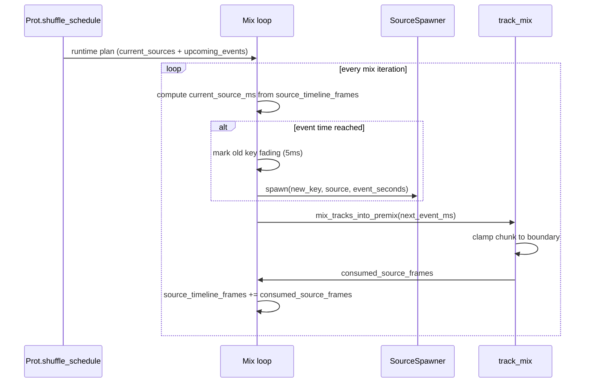

# Shuffle Points in Playback (Exact Runtime Behavior)

This note explains how `shuffle_points` are parsed, scheduled, and applied during playback.

## Where it is implemented

- Schedule build: `proteus-lib/src/container/prot.rs`
- Runtime event application: `proteus-lib/src/playback/engine/mix/runner.rs`
- Boundary-safe chunking + crossfade mix: `proteus-lib/src/playback/engine/mix/track_mix.rs`
- New source spawn at event time: `proteus-lib/src/playback/engine/mix/source_spawner.rs`

## 1) Precompute: how schedule entries are built

`Prot::refresh_tracks()` builds `shuffle_schedule` using:

- `build_id_shuffle_schedule(...)` for container track IDs.
- `build_paths_shuffle_schedule(...)` for direct file paths.

For each logical track:

1. `shuffle_points` are parsed by `parse_shuffle_points`:
- invalid strings are ignored (warn logged),
- values are sorted,
- duplicates are removed.
2. `selections_count` expands that logical track into multiple runtime slots.
3. Each slot gets an initial random source at `0 ms`.
4. For each shuffle timestamp, only slots whose track includes that timestamp redraw a random source.
5. A full schedule row is emitted at each timestamp (complete source list for all slots).

Important behavior:

- Random draw is with replacement; repeats are allowed.
- If `selections_count > 1`, those slots shuffle independently, even when they came from the same track definition.

## 2) Timestamp parsing rules

`parse_timestamp_ms(...)` accepts:

- `SS` (supports decimals, e.g. `12.5`)
- `MM:SS` (seconds part can be decimal)
- `HH:MM:SS` (seconds part can be decimal)

Rejected:

- negative values
- non-numeric values
- more than 3 colon-separated parts

Parsed milliseconds are rounded (`(seconds * 1000.0).round()`).

## 3) Runtime start position behavior

When playback starts (or seeks), `build_runtime_shuffle_plan(start_time)` does:

- pick the last schedule entry where `entry.at_ms <= start_time_ms` as current sources,
- place all later entries into `upcoming_events`.

That means starting at 47s begins with whichever sources were active at 47s, not always the 0s picks.

## 4) Mix loop: when a shuffle event actually applies

In `spawn_mix_thread` loop:

- `source_timeline_frames` tracks consumed source time.
- `current_source_ms` is derived from `source_timeline_frames`.
- Event(s) fire when `upcoming_events[next].at_ms <= current_source_ms`.

For each changed slot at that event:

1. old runtime key is put in `fading_tracks` with 5ms fade budget,
2. a new runtime key is allocated,
3. slot source is replaced,
4. decoder for the new source is spawned at `event_seconds`.

Unchanged slots at the same timestamp are left untouched.

## 5) Boundary safety: chunks do not cross an upcoming shuffle point

Before mixing each chunk, `mix_tracks_into_premix` clamps chunk size to the next event boundary:

- compute `samples_until_event` from `(next_event_ms - current_source_ms)`,
- `current_chunk = min(current_chunk, samples_until_event)`.

So one mixed chunk cannot span both pre-event and post-event source states.

## 6) Crossfade behavior at a shuffle boundary

Crossfade is short and one-sided:

- constant: `SHUFFLE_CROSSFADE_MS = 5.0` in `runner.rs`,
- outgoing source is kept under its old key and faded down linearly,
- incoming source starts immediately at full level (no explicit fade-in ramp).

Fade gain per outgoing frame:

- `fade_gain = (frames_remaining - frame_index) / total_frames`.

After fade frames are consumed, old key is removed from `fading_tracks` and eventually dropped from buffer map once empty.

## Visual 1: schedule build and event rows

```text
Input track config (example)

Track A: candidates [A1,A2], selections_count=1, shuffle_points=[10s,20s]
Track B: candidates [B1,B2,B3], selections_count=2, shuffle_points=[20s]

Expanded runtime slots

slot0 <- Track A
slot1 <- Track B (selection #1)
slot2 <- Track B (selection #2)

Schedule rows (full-slot snapshots)

0s   : [A2, B1, B3]   <- initial random picks
10s  : [A1, B1, B3]   <- only Track A slots redraw
20s  : [A1, B2, B1]   <- Track B slots redraw independently
```

## Visual 2: boundary and crossfade timeline

```text
source timeline --->

... [chunk N: pre-event only] ... | event @ T | [chunk N+1: post-event only] ...
                                  ^ chunk clamp boundary

Outgoing old key gain: 1.0 -> ... -> 0.0 over ~5ms
Incoming new key gain: 1.0 (immediate, no explicit fade-in ramp)
```

## Visual 3: runtime sequence



## 7) End-of-stream edge case with pending events

There is a guarded fallback for stalled schedules:

If all active/fading buffers are empty, premix/effect tail are empty, decode workers are finished, and there are still pending shuffle events that can no longer be reached, mix drain can force EOS to avoid hanging playback.

See `force_eos_from_stalled_schedule` in `runner.rs`.

## Practical summary

- Shuffle points are pre-expanded into a full timestamped slot schedule.
- Runtime applies events against source-consumed time (not post-DSP tail time).
- Chunk boundaries are clipped to event boundaries.
- Changed slots switch by spawning new keys, with a short outgoing fade of old keys.
